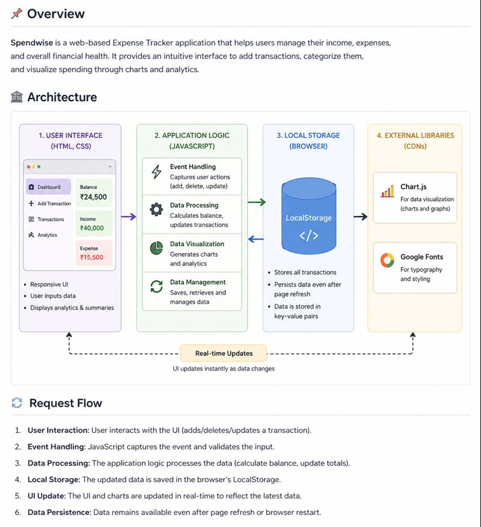

# 💰 Spendwise – Expense Tracker

---

## 📌 Overview

Spendwise is a web-based expense tracker that helps users manage their income and expenses efficiently.
It provides a clean interface to add transactions, track balance, and visualize spending using charts.

---

## 🏗️ Architecture

The application follows a client-side architecture:

* **User Interface (HTML, CSS):** Displays dashboard and forms
* **Application Logic (JavaScript):** Handles calculations and updates
* **LocalStorage:** Stores transaction data in the browser

Flow:
User → UI → JavaScript → LocalStorage → UI Update

---

## 🔄 Request Flow

1. User adds/updates a transaction
2. JavaScript captures the input
3. Data is processed (balance, totals calculated)
4. Data is stored in LocalStorage
5. UI updates in real-time

---

## 🧩 Components

* Dashboard (Balance, Income, Expense)
* Add Transaction Form
* Transactions List
* Analytics (Charts & Graphs)

---

## 🛠️ Tech Stack

* HTML
* CSS
* JavaScript
* LocalStorage

---

## 📂 Project Structure

* expense-tracker.html
* styles.css (if used)
* script.js (if separate JS file)

---

## ⚡ Performance

* Fast and lightweight
* Works entirely in browser
* No server required
* Instant updates

---

## ⚙️ Setup & Installation

1. Download or clone the repository
2. Open the project folder
3. Run the `expense-tracker.html` file in your browser

---

## 🔌 API Behaviour

* No external API used
* All operations handled on client-side
* Data stored using browser LocalStorage

---

## 🚀 Future Improvements

* Dark mode
* User authentication
* Cloud database integration
* Export data (CSV/PDF)

---

## 👨‍💻 Author

Your Name
(You can add your LinkedIn profile link here)
